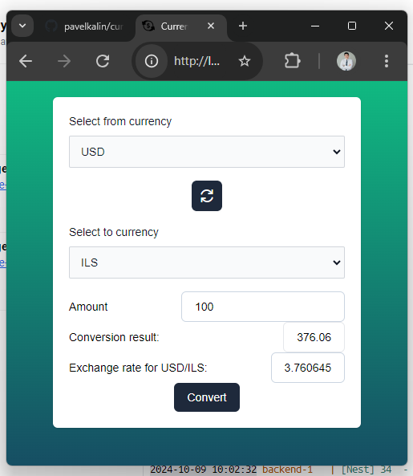
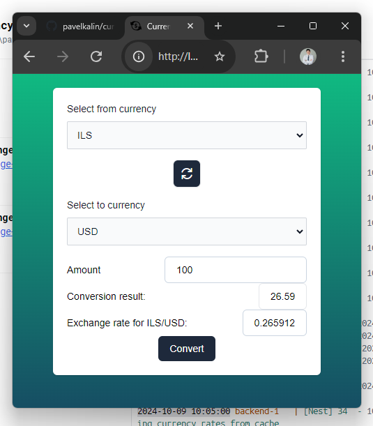
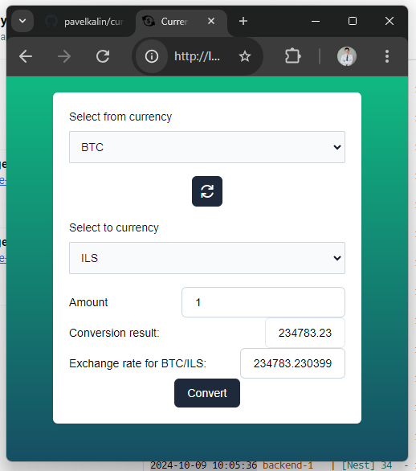

## Description

[Nest](https://github.com/nestjs/nest) framework TypeScript starter repository.

Full-stack currency exchange application that allows users to convert amounts between
different currencies. The application includes both frontend and backend components, with a
focus on implementing caching for performance optimization.

### Backend

* Nest.js
* Redis

### Frontend

* Vite/Vue.js 3
* Tailwind CSS

## Overview

### Backend

Input validation is done via ``` app.useGlobalPipes(new ValidationPipe())```. 
That allows to use Dtos like [convert-currency.dto.ts](src%2Fapp%2Fapi%2Fdto%2Fconvert-currency.dto.ts)```ConvertCurrencyDto```.
Currency exchange rates are taken from Open Exchange Rates API (vendor API). They cache responses hourly. 
So TTL for internal cache is a diff between next hour and time of initial request.
During start of the app available currencies are requested from vendor API and put into cache in
[tasks.service.ts](src%2Fapp%2Fcron-jobs%2Ftasks.service.ts).
Conversion result is rounded to a least second decimal point. 

### Frontend

Conversion result is updated reactively on currency swap, amount change and on click of Convert button.
From UX perspective button is not needed, but it was a feature requirement, so it's present.


## Running the app

```bash
# start service
$ sh fillK.sh && docker-compose up --build

# closing service
$ docker-compose down
```
[Application](http://localhost:8080) should be available by http://localhost:8080



